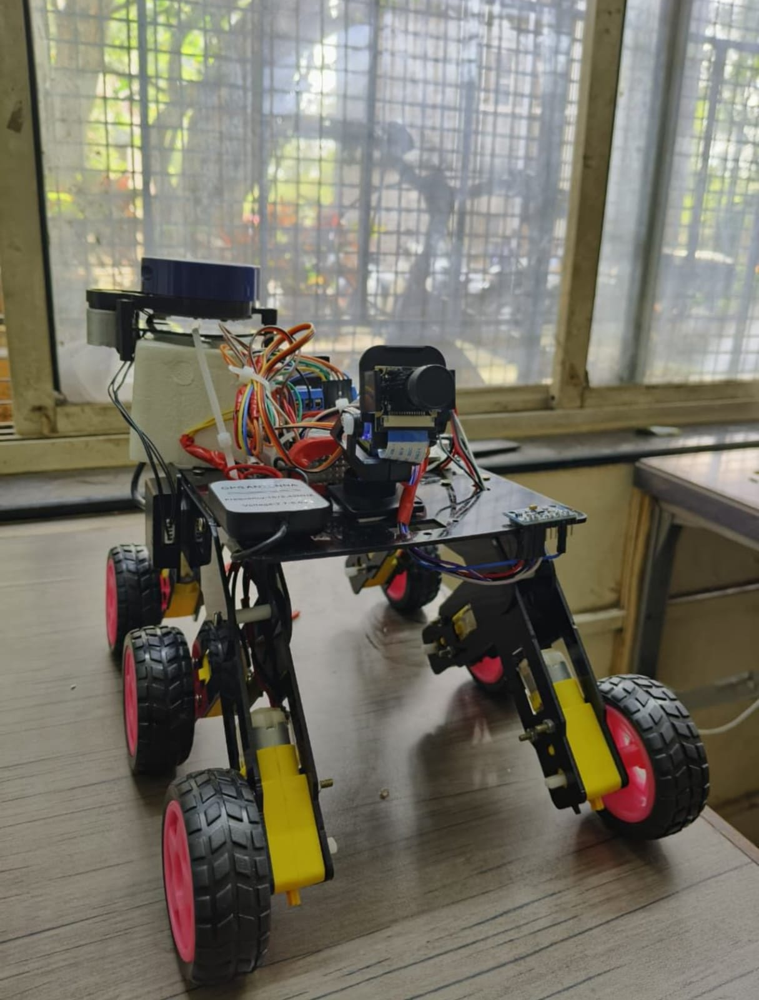
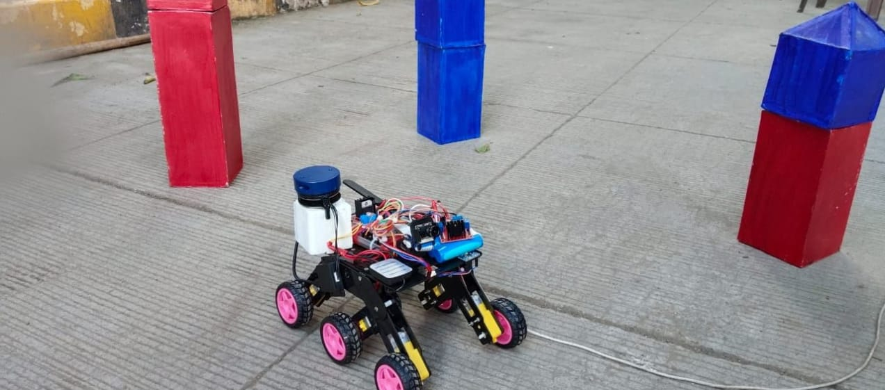
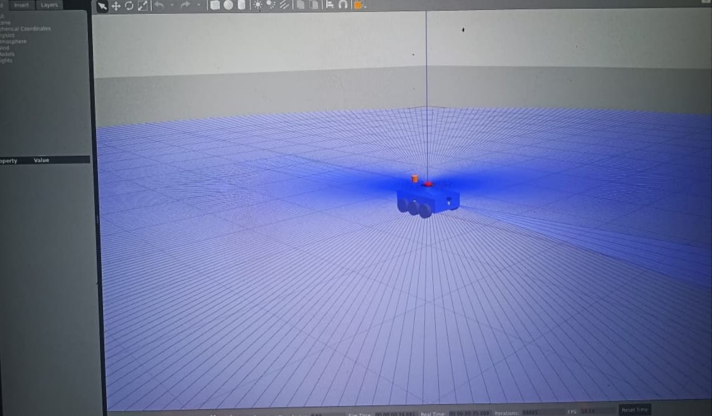
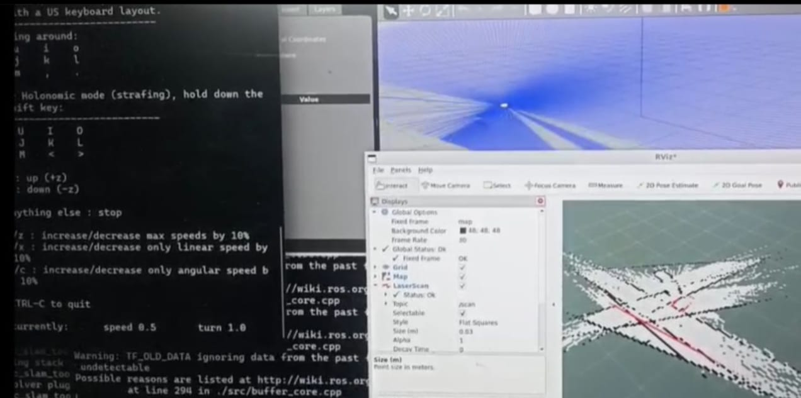
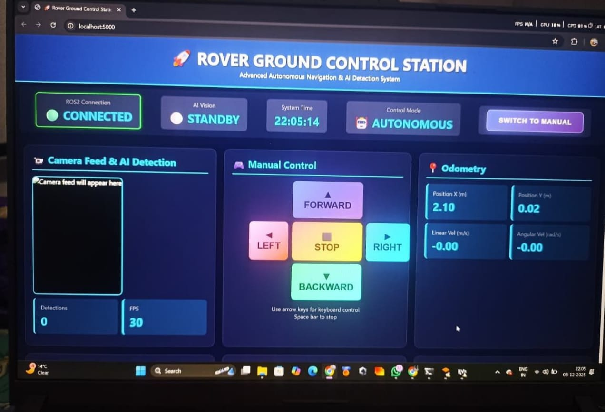
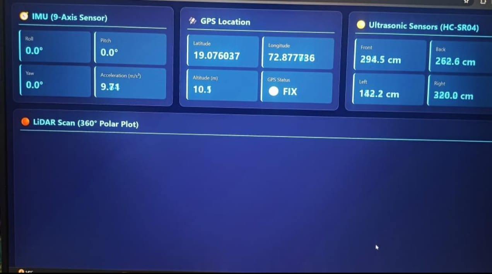
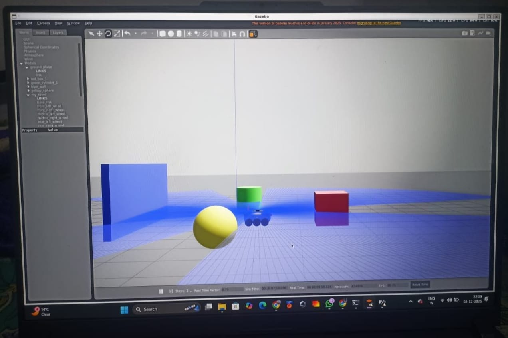
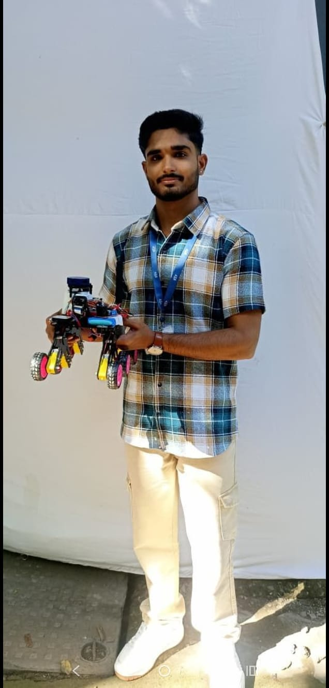
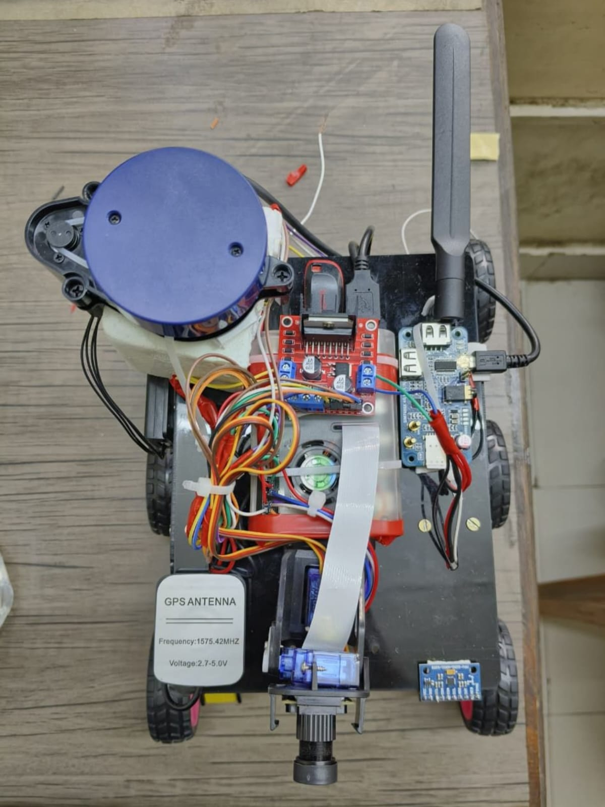

# 🛰️ Autonomous Surveillance Rover

An autonomous ground rover built for waypoint navigation, SLAM-based mapping,
and real-time visual surveillance in diverse terrain — designed with
resource-constrained compute in mind.

📌 **Project update / demo:** [View on LinkedIn](https://www.linkedin.com/posts/atharv-joshi-ai_ros2-reinforcementlearning-edgeai-ugcPost-7445366709466873856-DfiY/)

---

## Problem Statement

Build a rover capable of autonomous waypoint navigation across diverse
terrains, operating under highly constrained compute hardware — targeting
tactical/battlefield mobility and surveillance use cases where GPS-denied,
low-power, edge-deployable navigation is essential.

---

## 🧠 System Architecture

```
                    ┌──────────────────────────┐
                    │       Sensor Suite        │
                    │  Camera · LiDAR · IMU ·   │
                    │   GPS · Ultrasonic        │
                    └────────────┬─────────────┘
                                 │
                                 ▼
                    ┌──────────────────────────┐
                    │   rover_navigation        │
                    │  SLAM (async mapping) +   │
                    │  Nav2 (path planning &    │
                    │  obstacle avoidance)      │
                    └────────────┬─────────────┘
                                 │
                                 ▼
                    ┌──────────────────────────┐
                    │        my_rover           │
                    │  Motion control, sensor    │
                    │  simulation, obstacle      │
                    │  avoidance logic           │
                    └────────────┬─────────────┘
                                 │
                    ┌────────────┴─────────────┐
                    ▼                           ▼
        ┌───────────────────────┐   ┌───────────────────────┐
        │      rover_gcs         │   │    my_rover_launch     │
        │  Flask dashboard +     │   │  Bring-up, spawn, and  │
        │  YOLOv8 live vision    │   │  transform launch files│
        └───────────────────────┘   └───────────────────────┘
```

---

## 📦 Package Breakdown

### `rover_navigation`
Navigation and mapping stack built on **Nav2** and **SLAM Toolbox**.

- `config/nav2_params.yaml` — Nav2 stack configuration (costmaps, planners,
  controllers, recovery behaviors)
- `config/mapper_params_online_async.yaml` — online asynchronous SLAM
  mapping configuration
- `launch/navigation.launch.py` — brings up the full Nav2 navigation stack
- `launch/slam.launch.py` — launches SLAM mapping independently

**What it does:** builds a live occupancy map of unknown terrain while the
rover moves, and uses that map (plus costmaps and a global/local planner)
to plan and follow collision-free paths to waypoints.

### `rover_gcs` (Ground Control Station)
A web-based control and monitoring dashboard with live computer vision.

- `app.py` — Flask server backing the dashboard
- `ai_vision.py` — real-time object detection using a **YOLOv8** model
  (`models/yolov8n.pt` — the nano variant, chosen for lightweight/edge
  inference)
- `templates/dashboard.html`, `templates/index.html` — web UI for
  monitoring rover state and camera feed
- `requirements.txt` — Python dependencies for the GCS service

**What it does:** gives an operator a browser-based view into what the
rover sees and is doing — live video with YOLO-based object/obstacle
detection overlaid, likely alongside telemetry and control from the
dashboard.

### `my_rover`
Core rover behavior package.

- `my_rover/sensor_simulator.py` — simulates sensor input (for testing
  without physical hardware / in Gazebo)
- `my_rover/obstacle_avoidance.py` — reactive obstacle avoidance logic
- `worlds/obstacles.world` — Gazebo simulation world with obstacles for
  testing navigation and avoidance behavior
- `urdf/rover.urdf` — base robot description

### `my_rover_launch`
Launch files that bring the whole simulated rover to life.

- `spawn_rover.launch.py` / `spawn_rover_obstacles.launch.py` — spawn the
  rover into Gazebo, with or without an obstacle course
- `spawn_rover_with_state.launch.py` — spawn with state publishing (for
  TF/odometry)
- `slam_mapping.launch.py` — launches SLAM mapping in the simulated
  environment
- `wheel_transforms.launch.py` — publishes wheel transform frames

### `my_rover_package`
Sensor description package — defines the physical sensor suite via
URDF/Xacro (see below).

---

## 🔧 Sensor Suite (URDF / Xacro)

Defined in `my_rover_package/urdf/`:

| Sensor | File | Purpose |
|---|---|---|
| Camera | `camera.xacro` | Visual feed for YOLO-based object detection in `rover_gcs` |
| LiDAR | `lidar.xacro` | 360° range scanning for obstacle detection and SLAM |
| IMU | `imu.xacro` | Orientation and motion sensing for odometry/state estimation |
| GPS | `gps.xacro` | Global positioning for outdoor waypoint navigation |
| Ultrasonic | `ultrasonic.xacro` | Short-range proximity sensing for close-obstacle avoidance |

Together these feed both the SLAM/Nav2 stack (LiDAR, IMU, GPS) and the
vision/monitoring stack (camera → YOLOv8 in `rover_gcs`).

The `frames_*.gv` / `frames_*.pdf` files in `docs/` are TF tree diagrams
generated from the running system, showing how all these sensor frames
relate to the rover's base frame.

---

## 🗂️ Repository Structure

```
Autonomous-Surveillance-Rover/
├── src/
│   ├── my_rover/              # Core behavior, sim, obstacle avoidance
│   ├── my_rover_launch/       # Simulation bring-up launch files
│   ├── my_rover_package/      # Sensor URDF/Xacro definitions
│   ├── rover_gcs/             # Flask dashboard + YOLOv8 vision
│   └── rover_navigation/      # Nav2 + SLAM stack
├── archive/
│   └── rover_ws_early_attempt/ # Earlier iteration, kept for history
├── config/                    # Bringup scripts, maps, RViz config
├── docs/                      # TF frame diagrams
├── media/                     # Screenshots, demo videos
├── .gitignore
└── README.md
```

---

## 🚀 Getting Started

```bash
# Clone the repo
git clone https://github.com/atharv348/Autonomous-Surveillance-Rover.git
cd Autonomous-Surveillance-Rover

# Build the workspace (from src/)
colcon build --symlink-install
source install/setup.bash

# Launch the simulated rover with obstacles
ros2 launch my_rover_launch spawn_rover_obstacles.launch.py

# In a separate terminal, start SLAM mapping
ros2 launch my_rover_launch slam_mapping.launch.py

# Start Nav2 navigation
ros2 launch rover_navigation navigation.launch.py

# Start the ground control station dashboard
cd src/rover_gcs
pip install -r requirements.txt
python app.py
```

> Adjust these commands if your actual entry points differ — this is
> based on the launch files present in the repo.

---

## 📁 Archive

`archive/rover_ws_early_attempt/` contains an earlier version of
`my_rover_launch` and `my_rover_package`, preserved to document the
project's development history. Not actively maintained.

A recorded rosbag mission (~327MB) exists locally but isn't included here
due to GitHub's file size limits — available on request or via Git LFS.

---

## 📸 Media



















---

## 📊 Status

🚧 Work in progress — currently refining navigation robustness across
terrain types and expanding the vision pipeline in `rover_gcs`.

---

## 👤 Author

**Atharv Joshi** — B.Tech AI & ML, D.Y. Patil University, Kolhapur
[LinkedIn](https://www.linkedin.com/posts/atharv-joshi-ai_ros2-reinforcementlearning-edgeai-ugcPost-7445366709466873856-DfiY/)
