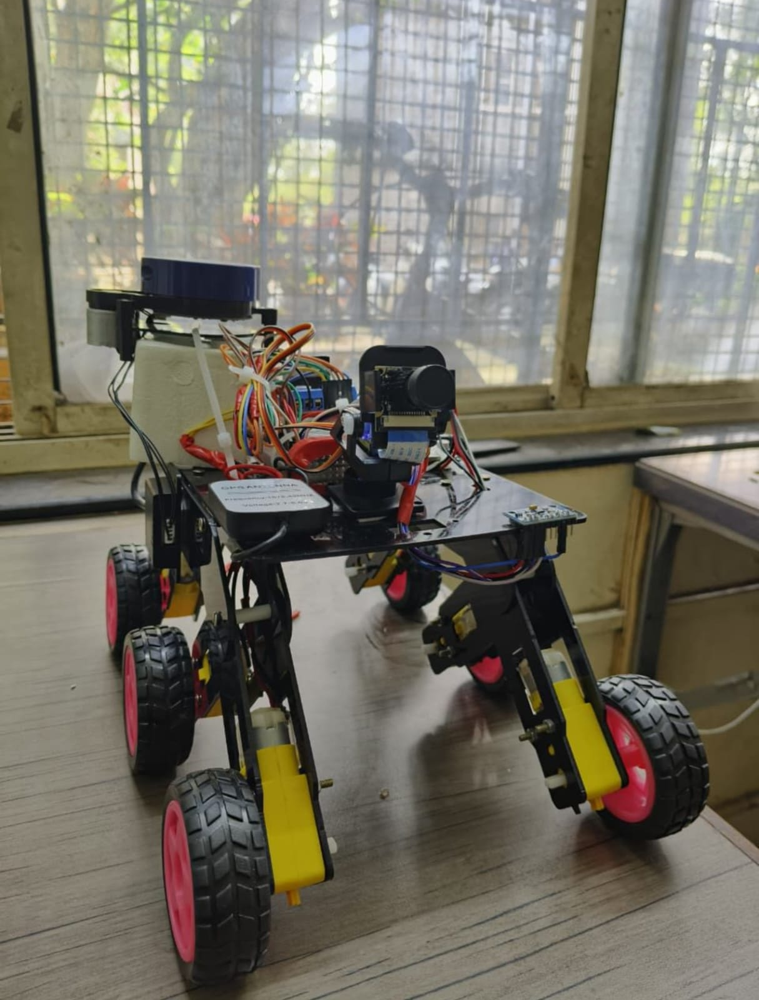
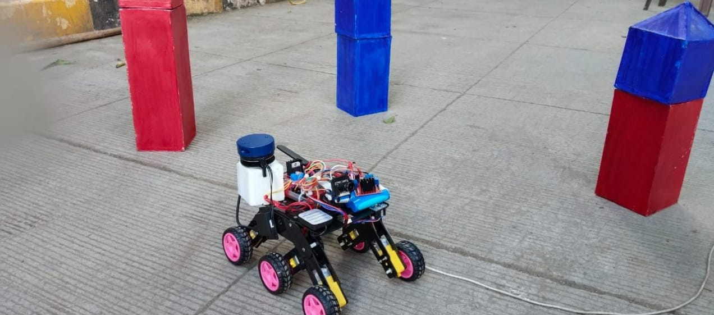
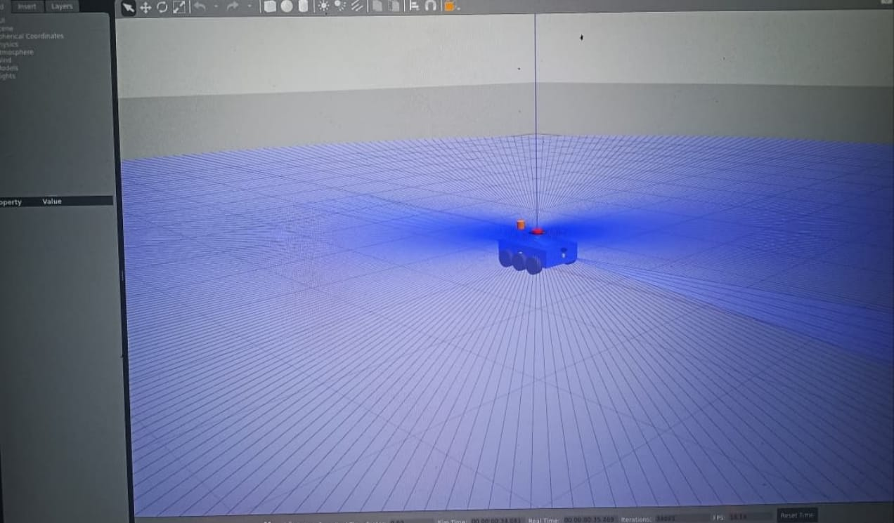

# 🛰️ Autonomous Surveillance Rover — Internship Assessment

An autonomous ground rover built for waypoint navigation, SLAM-based mapping, real-time visual surveillance, and 6-axis manipulator toolpath generation — designed with resource-constrained compute in mind.

Author: **Atharv Joshi**  
Stack: ROS 2 Humble (in Docker / WSL2), Gazebo Classic, Nav2, SLAM Toolbox, Python  
📹 **Video Demonstration (Google Drive):** [Watch Video Demonstration](https://drive.google.com/drive/u/0/folders/1duk6e5Rs1KtrupEqTI7CTjME6bO1q5Mo)

---

## 📋 Task Mapping & Overview

Detailed technical writeups for all three tasks are documented in **[TECHNICAL_DOCUMENTATION.md](file:///D:/GitHub/Autonomous-Surveillance-Rover/TECHNICAL_DOCUMENTATION.md)**.

| Task | Objective | Primary Folder / File Location |
|---|---|---|
| **Task 1** | Autonomous Navigation with Dynamic Obstacle Replanning | `src/rover_navigation/` & `src/my_rover_launch/` |
| **Task 2** | Custom ROS 2 Navigation Monitoring Node (`nav_monitor`) | `src/rover_navigation/scripts/nav_monitor.py` |
| **Task 3** | 6-Axis Robot Toolpath Generation for a Cone Surface | `task3_cone_toolpath/` |

---

## 🧠 System Architecture

```
                    ┌──────────────────────────┐
                    │       Sensor Suite        │
                    │  Camera · LiDAR · IMU ·   │
                    │   GPS · Ultrasonic        │
                    └────────────┬─────────────┘
                                 │
                                 ▼
                    ┌──────────────────────────┐
                    │   rover_navigation        │
                    │  SLAM (async mapping) +   │
                    │  Nav2 (path planning &    │
                    │  obstacle avoidance)      │
                    └────────────┬─────────────┘
                                 │
                                 ▼
                    ┌──────────────────────────┐
                    │        my_rover           │
                    │  Motion control, sensor    │
                    │  simulation, obstacle      │
                    │  avoidance logic           │
                    └────────────┬─────────────┘
                                 │
                    ┌────────────┴─────────────┐
                    ▼                           ▼
        ┌───────────────────────┐   ┌───────────────────────┐
        │      rover_gcs         │   │    my_rover_launch     │
        │  Flask dashboard +     │   │  Bring-up, spawn, and  │
        │  YOLOv8 live vision    │   │  transform launch files│
        └───────────────────────┘   └───────────────────────┘
```

---

## 🗂️ Repository Structure

```text
Autonomous-Surveillance-Rover/
│
├── README.md                          ← Overview & task folder mapping
├── TECHNICAL_DOCUMENTATION.md         ← Comprehensive writeup for all 3 tasks
├── .gitignore
│
├── src/                               ← TASK 1 & 2: ROS 2 Workspace Packages
│   ├── my_rover/                      # Rover body URDF, world, reactive avoidance
│   │   ├── package.xml, setup.py, setup.cfg
│   │   ├── my_rover/
│   │   │   ├── obstacle_avoidance.py
│   │   │   └── sensor_simulator.py
│   │   ├── urdf/rover.urdf            # URDF base model (with corrected LiDAR plugin)
│   │   └── worlds/obstacles.world
│   │
│   ├── my_rover_launch/               # Simulation bring-up & launch files
│   │   ├── CMakeLists.txt, package.xml, setup.py, setup.cfg
│   │   ├── config/mapper_params_online_async.yaml
│   │   └── launch/  (spawn_rover*, slam_mapping, wheel_transforms)
│   │
│   ├── my_rover_package/              # Sensor URDF/Xacro definitions
│   │   ├── package.xml, setup.py, setup.cfg
│   │   └── urdf/  (camera, gps, imu, lidar, ultrasonic, my_rover.urdf.xacro)
│   │
│   ├── rover_navigation/              # TASK 1 Nav2 stack + TASK 2 monitor node
│   │   ├── CMakeLists.txt, package.xml
│   │   ├── config/
│   │   │   ├── nav2_params.yaml       # Nav2 params (tuned frequencies & plugins)
│   │   │   └── mapper_params_online_async.yaml
│   │   ├── launch/  (navigation.launch.py, slam.launch.py)
│   │   └── scripts/
│   │       └── nav_monitor.py         # ← TASK 2: Navigation Monitoring Node
│   │
│   └── rover_gcs/                     # Ground Control Station (Flask + YOLOv8)
│       ├── package.xml, requirements.txt, setup.py
│       └── rover_gcs/  (app.py, ai_vision.py, templates/ dashboard & index)
│
├── task3_cone_toolpath/               ← TASK 3: 6-Axis Toolpath Generation
│   ├── cone_toolpath.py              # Toolpath & IK solver script
│   ├── cone_toolpath.csv              # Exported timestamped joint trajectory (300 rows)
│   └── cone_geometry.csv              # Exported cone surface reference points
│
├── config/                            # RViz configs, maps, bringup scripts
├── docs/                              # TF frame diagrams (frames_*.gv / .pdf)
├── media/                             # System screenshots & demo media
│   └── rover_01.jpeg ... rover_09.jpeg
│
└── archive/                           # Earlier iterations preserved for history
    └── rover_ws_early_attempt/
```

---

## 📦 Package Breakdown & Deliverables

### Task 1 — Autonomous Navigation with Dynamic Obstacle Replanning
- **Location**: `src/rover_navigation/` & `src/my_rover_launch/`
- **Key Features**: 
  - Differential drive rover with simulated sensors (LiDAR, Camera, IMU, GPS, Ultrasonic).
  - Online asynchronous mapping via **SLAM Toolbox**.
  - **Nav2** global and local path planning with dynamic obstacle detection and automatic costmap rerouting.
  - Parameter frequency tuning (5 Hz controller, 2 Hz planner) optimized for containerized compute limits.

### Task 2 — Custom ROS 2 Navigation Monitoring Node (`nav_monitor`)
- **Location**: `src/rover_navigation/scripts/nav_monitor.py`
- **Key Features**:
  - Read-only ROS 2 Python node observing navigation state without interfering with control.
  - Subscribes to `/goal_pose`, `/navigate_to_pose/_action/feedback`, and `/navigate_to_pose/_action/status`.
  - 1 Hz live console reporting: Goal coordinates, Remaining Distance, and Status (`IDLE`, `NAVIGATING`, `REPLANNING`, `SUCCEEDED`, `FAILED`).

### Task 3 — 6-Axis Robot Toolpath Generation for a Cone Surface
- **Location**: `task3_cone_toolpath/`
- **Key Features**:
  - Parametric cone surface helix generation (300 points, 5 turns).
  - 6-DOF UR5 kinematic model with inverse kinematics (IK) and warm-starting for continuous joint trajectories.
  - Generates `cone_toolpath.csv` (`Time, Joint1..Joint6`) and `cone_geometry.csv` (`Time, X, Y, Z`).

---

## 🚀 Getting Started

```bash
# Clone the repo
git clone https://github.com/atharv348/Autonomous-Surveillance-Rover.git
cd Autonomous-Surveillance-Rover

# Build the ROS 2 workspace (from src/)
colcon build --symlink-install
source install/setup.bash

# 1. Launch the simulated rover with obstacles
ros2 launch my_rover_launch spawn_rover_obstacles.launch.py

# 2. Launch SLAM mapping
ros2 launch my_rover_launch slam_mapping.launch.py

# 3. Launch Nav2 navigation
ros2 launch rover_navigation navigation.launch.py

# 4. Run Task 2 Navigation Monitor Node
ros2 run rover_navigation nav_monitor.py

# 5. Run Task 3 Toolpath Generator (Standalone Python)
cd task3_cone_toolpath
python cone_toolpath.py
```

---

## 📸 Media





---

## 👤 Author

**Atharv Joshi** — B.Tech AI & ML, D.Y. Patil University, Kolhapur  
[LinkedIn Profile](https://www.linkedin.com/posts/atharv-joshi-ai_ros2-reinforcementlearning-edgeai-ugcPost-7445366709466873856-DfiY/)
